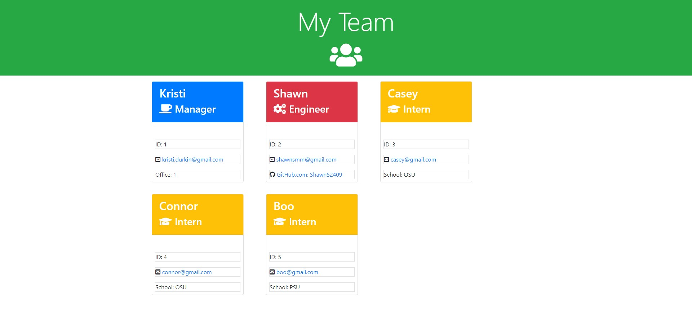

# Team Profile Generator
Created by Shawn Miller

# Technologies Used
- Node.js
- npm Inquirer
- npm fs
- Jest
- JavaScript

# Description
This app was created for a manager to be able to build a team of employees.  This app uses node.js to create to create three types of employees. The manager will be created first and then they can build a team of engineers and interns.  The manager class will prompt for the employee's ID, email and office number.  The engineer class will prompt for the employee's ID, email and GitHub user name.  The intern class will prompt for the employee's ID, email and school they are attending.  After the manager has filled out his team and clicks on "Finish building my team" the app will create a html page in the 'dist' directory which diplays each employee with their respective information in organized blocks.  The manager can also click on the emails to open an email browser to send an email to the employee.  The manager can also click on the engineer's Git Hub user name and be taken to the engineer's Git Hub's page.

# Installation Instructions
A user will need to download and install node.js, npm Inquirer and npm fs.  Once installed the user will just need run a 'node index.js' at the command prompt.  When the app starts the user will just need to following the directions from each new prompt to create their team

# Appearance

# Known Bugs
No known bugs.

# Contact info
shawnsmm@gmail.com

github.com/Shawn52409

www.linkedin.com/in/shawn-miller-b44a36217